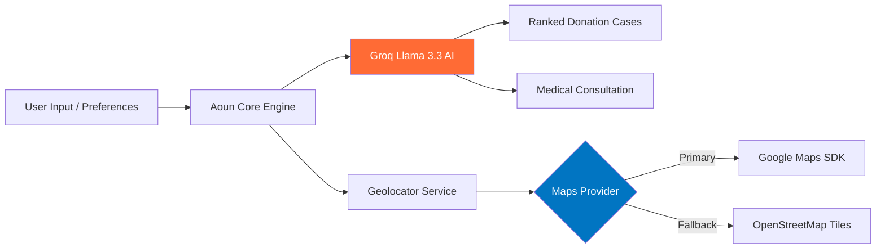

<div align="center">

<!-- HERO BANNER -->


<br/>

<p align="center">
  <a href="https://flutter.dev"></a>
  <a href="https://dart.dev"></a>
  <a href="#"></a>
  <a href="#"></a>
  <a href="#"></a>
  <a href="#"></a>
  <a href="https://drive.google.com/file/d/13CSmCkHRxiOBGQTtDrVgsCo67G_cniq5/view?usp=drivesdk" target="_blank"></a>
</p>

<p align="center">
  <a href="https://github.com/Ahm3dmohamed/aoun/stargazers"></a>
  <a href="https://github.com/Ahm3dmohamed/aoun/network/members"></a>
  <a href="https://github.com/Ahm3dmohamed/aoun/issues"></a>
  <a href="https://github.com/Ahm3dmohamed/aoun/blob/main/LICENSE"></a>
</p>

> **Aoun (عون)** is an AI-powered donation & healthcare assistance platform built with Flutter and Clean Architecture. It uses Groq's Llama models to recommend verified cases, analyze symptoms via AI, locate nearby medical centers, and streamline humanitarian giving.

[📱 Screenshots](#-screenshots) · [⚡ Quick Start](#-quick-start) · [🏗️ Architecture](#️-architecture) · [🤖 AI & Maps](#-ai--maps-engine) · [📬 Author](#-author)

</div>

---

## ⚡ Key Highlights

<table>
<tr>
<td width="50%">

### 🎯 Core Capabilities
- 🤖 **AI Case Matching**: Context-aware recommendations via Groq Llama 3.3.
- 🩺 **AI Health Assistant**: Symptom checking & guided medical consultation.
- 📍 **Smart Location**: Interactive Google Maps & OpenStreetMap fallback.
- 🩸 **Multi-Category Giving**: Blood, Food, Clothes, Financial & Medical Supplies.
- 🌐 **Bilingual (AR / EN)**: Native RTL/LTR UI via `easy_localization`.

</td>
<td width="50%">

### 🛡️ Production Engineering
- 🏛️ **Clean Architecture**: Domain-driven feature-first codebase.
- 🔄 **BLoC / Cubit**: Predictable, reactive state management.
- 🔒 **AES-256 Storage**: Encrypted secret storage (`flutter_secure_storage`).
- ⚡ **Type-Safe Networking**: Dio + Retrofit API clients.
- 🧊 **Immutable Models**: Code-generated models via `freezed` & `json_serializable`.

</td>
</tr>
</table>

---

## 📸 Screenshots

<div align="center">

| 1. Registration & Preferences | 2. Request Assistance | 3. Profile & Settings |
|:---:|:---:|:---:|
|  |  |  |

<br/>

| 4. Home & AI Health Assistant | 5. AI Recommended Donations |
|:---:|:---:|
|  |  |

</div>

---

## 🏗️ System Architecture

Aoun adheres to **Clean Architecture** with strict layer separation:

```mermaid
graph TD
    subgraph UI ["🎨 Presentation Layer"]
        Page[Widgets & Screens]
        State[BLoC / Cubit]
    end

    subgraph Core ["🧠 Domain Layer"]
        UC[Use Cases]
        Entity[Entities]
        RepoDef[Repository Interfaces]
    end

    subgraph Data ["💾 Data Layer"]
        RepoImpl[Repository Implementations]
        DS[Remote & Local DataSources]
        Model[DTO Models]
    end

    subgraph Infra ["🌐 Infrastructure & Services"]
        Laravel[Laravel REST API]
        Groq[Groq AI Engine]
        Maps[Google Maps / OSM]
        Secure[Secure Storage]
    end

    Page --> State --> UC --> RepoDef
    RepoImpl ..|> RepoDef
    UC --> Entity
    RepoImpl --> DS
    DS --> Model
    DS --> Laravel & Groq & Maps & Secure

    style UI fill:#02569B,color:#fff
    style Core fill:#008059,color:#fff
    style Data fill:#D97706,color:#fff
    style Infra fill:#4B5563,color:#fff
```

<details>
<summary><b>📂 View Project Tree</b></summary>

```
lib/
├── core/
│   ├── di/                 # GetIt Dependency Injection container
│   ├── network/            # Dio HTTP Client, Interceptors & Error handling
│   ├── storage/            # Secure Storage & SharedPreferences
│   ├── utils/              # Text Styles, Helpers, Secrets Template
│   └── widgets/            # Reusable UI components
├── features/
│   ├── auth/               # Login, Register & Preference selection
│   ├── home/               # Navigation & Dashboard
│   ├── recommendations/    # AI-Ranked donation campaign feeds
│   ├── ai_chat/            # AI Assistant & Symptom checker
│   ├── maps/               # Interactive map & nearby facility locator
│   ├── profile/            # User settings & language selection
│   └── request_assistance/ # Assistance request submission flow
└── l10n/                   # AR / EN Translation definitions
```

</details>

---

## 🤖 AI & Maps Engine



---

## 🛠️ Tech Stack

| Category | Technologies |
|----------|--------------|
| **Core Framework** | Flutter 3.x, Dart 3.x |
| **Architecture** | Clean Architecture, Feature-First, Repository Pattern |
| **State Management** | Flutter BLoC, Cubit |
| **Networking & API** | Dio, Retrofit, REST API (Laravel Backend) |
| **Serialization** | Freezed, Json Serializable, Build Runner |
| **AI Integration** | Groq API (`llama-3.3-70b-versatile`) |
| **Location & Maps** | Google Maps SDK, OpenStreetMap (`flutter_map`), Geolocator |
| **Security & Local Data** | Flutter Secure Storage (AES-256), Shared Preferences |
| **Localization** | Easy Localization (Arabic & English with RTL support) |
| **DI & Utilities** | GetIt, Dartz (`Either`), Logger, Cached Network Image, Flutter SVG |

---

## ⚡ Quick Start

### 1. Clone & Configure Secrets

```bash
git clone https://github.com/Ahm3dmohamed/aoun.git
cd aoun

# Create local secrets file (gitignored)
cp lib/core/utils/secrets.dart.example lib/core/utils/secrets.dart
```

Add your API keys to `lib/core/utils/secrets.dart`:
```dart
class Secrets {
  static const openAIKey = "YOUR_OPENAI_KEY";
  static const apiKey    = "YOUR_GROQ_API_KEY";
}
```

### 2. Install & Run

```bash
# Get dependencies
flutter pub get

# Generate code
dart run build_runner build --delete-conflicting-outputs

# Run app
flutter run
```

---

## 🔒 Security & Environment

- **Zero Hardcoded Secrets**: All API keys reside in `secrets.dart` which is explicitly listed in `.gitignore`.
- **History Scrubbed**: Repository git history is clean of sensitive tokens.
- **Secure Token Storage**: Authentication tokens are encrypted on-device via Android Keystore / iOS Keychain (`flutter_secure_storage`).

---

## 📬 Author

<div align="center">

### **Ahmed Mohamed**
*Flutter Developer & Open-Source Enthusiast*

<br/>

[](https://github.com/Ahm3dmohamed)
[](https://www.linkedin.com/in/ahmed-mohamed-21a812265)
[](https://drive.google.com/file/d/13CSmCkHRxiOBGQTtDrVgsCo67G_cniq5/view?usp=drivesdk)
[](mailto:ahm3dmo00@gmail.com)

<br/>

⭐️ **If you found this project helpful, give it a star!** ⭐️

</div>

---

<div align="center">


*Built with ❤️ using Flutter & Groq AI*

</div>
