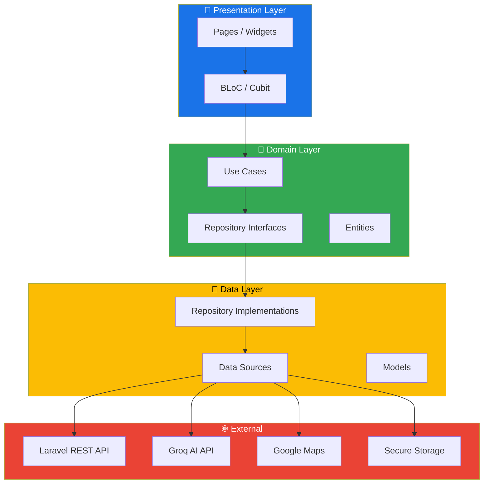
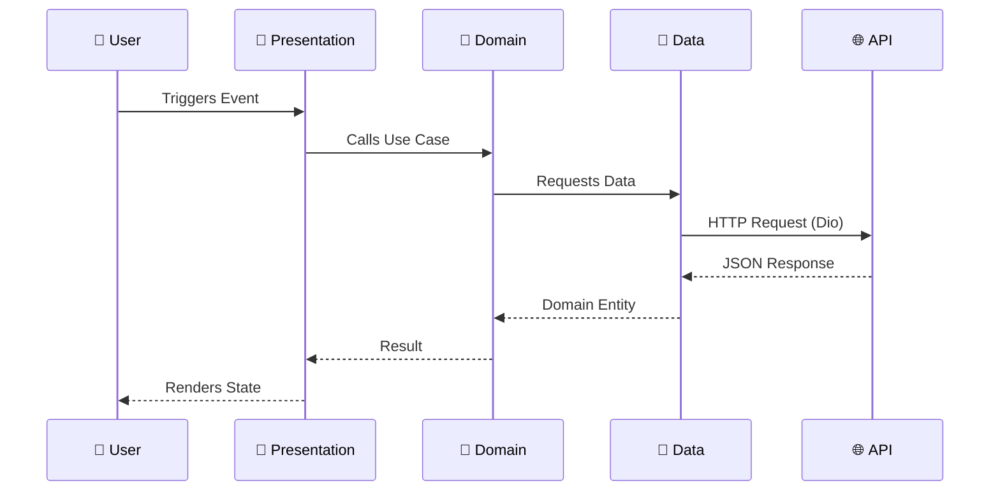
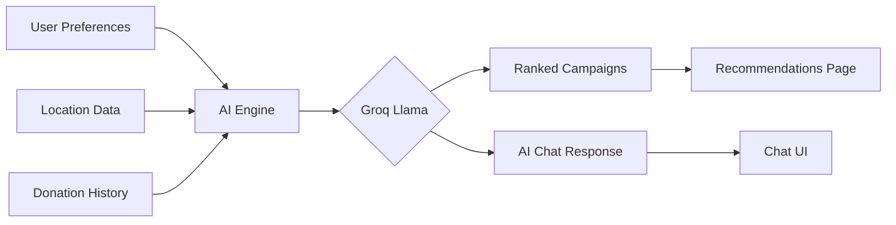
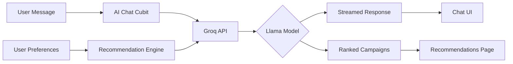
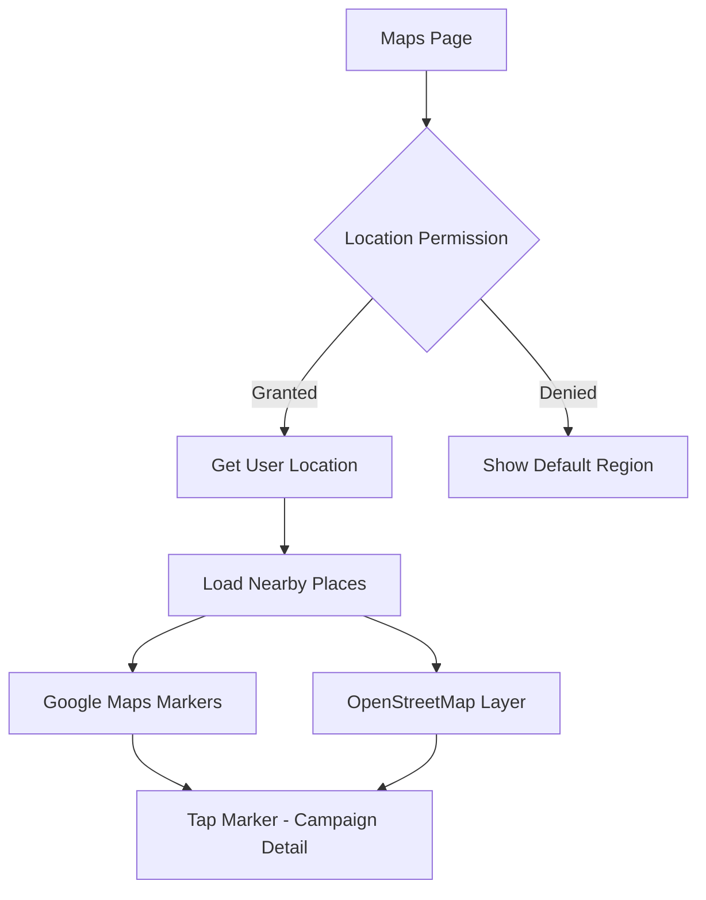
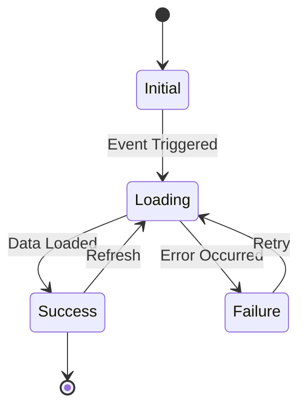

<div align="center">

<!-- HERO BANNER -->


<!-- LOGO PLACEHOLDER -->
<br/>

<br/><br/>

# 🤝 Aoun — عون

### *Bridging Generosity with Technology*

<p align="center">
  <a href="https://flutter.dev"></a>
  <a href="https://dart.dev"></a>
  <a href="#"></a>
  <a href="#"></a>
  <a href="#"></a>
  <a href="#"></a>
  <a href="#"></a>
  <a href="#"></a>
</p>

<p align="center">
  
  
  
</p>

<br/>

> **Aoun** (عون — Arabic for "help") is an intelligent, AI-powered donation platform that seamlessly connects generous donors with verified campaigns, hospitals, and charities. Powered by Groq's Llama models, it understands your preferences and recommends the causes that matter most.

<br/>

[📱 View Demo](#-demo) · [🚀 Get Started](#-installation) · [📖 Documentation](#-table-of-contents) · [🐛 Report Bug](https://github.com/Ahm3dmohamed/aoun/issues) · [✨ Request Feature](https://github.com/Ahm3dmohamed/aoun/issues)

</div>

---

## 📋 Table of Contents

<details>
<summary>Click to expand</summary>

- [🌟 Overview](#-overview)
- [✨ Features](#-features)
- [🏗️ Architecture](#️-architecture)
- [📁 Folder Structure](#-folder-structure)
- [📸 Screenshots](#-screenshots)
- [🎬 Demo](#-demo)
- [🚀 Installation](#-installation)
- [📋 Requirements](#-requirements)
- [🔐 Environment Variables](#-environment-variables)
- [🧱 Technologies Used](#-technologies-used)
- [🤖 AI Features](#-ai-features)
- [🗺️ Maps Features](#️-maps-features)
- [🔒 Security](#-security)
- [⚡ Performance Optimizations](#-performance-optimizations)
- [🔄 State Management](#-state-management)
- [🔌 API Integration](#-api-integration)
- [🔮 Future Improvements](#-future-improvements)
- [🤝 Contributing](#-contributing)
- [📄 License](#-license)
- [📬 Contact](#-contact)
- [⭐ Support](#-support)

</details>

---

## 🌟 Overview

**Aoun** is a graduation project built with Flutter that reimagines how people give. Instead of scrolling through generic donation feeds, Aoun uses **on-device AI intelligence** to understand each user's giving preferences and surfaces campaigns that align with their values.

Whether you want to donate blood, clothes, food, or money — Aoun finds the right place, at the right time, near you.

```
🌍  Multi-language   →  Arabic & English (RTL + LTR)
🤖  AI-powered       →  Groq API + Llama for smart recommendations & chat
🗺️  Location-aware   →  Google Maps + OpenStreetMap integration
🔒  Secure           →  Flutter Secure Storage for sensitive data
📱  Cross-platform   →  Android & iOS
```

---

## ✨ Features

<table>
<tr>
<td width="50%">

### 🎯 Core Features
- ✅ Discover verified donation campaigns
- ✅ Real-time campaign search & filtering
- ✅ Donation type selection (Blood, Food, Clothes, Money, Books, Medical Supplies)
- ✅ Track personal donation requests
- ✅ Manage user profile with preferences
- ✅ Campaign detail pages with progress indicators

</td>
<td width="50%">

### 🤖 AI & Smart Features
- ✅ AI-powered donation recommendations
- ✅ In-app AI chat assistant
- ✅ Preference-based campaign matching
- ✅ Context-aware conversation history
- ✅ Groq Llama model integration
- ✅ Smart suggestion engine

</td>
</tr>
<tr>
<td width="50%">

### 🗺️ Location Features
- ✅ Nearby hospitals & charities on map
- ✅ Google Maps integration
- ✅ OpenStreetMap fallback
- ✅ Distance-based sorting
- ✅ Location permission handling
- ✅ Interactive map markers

</td>
<td width="50%">

### 🌐 Accessibility & UX
- ✅ Full Arabic & English support
- ✅ RTL layout support
- ✅ Dark/Light theming
- ✅ Smooth animations & transitions
- ✅ Cached network images
- ✅ Offline-friendly architecture

</td>
</tr>
</table>

---

## 🏗️ Architecture

Aoun follows **Clean Architecture** principles with a **Feature-first** folder structure, ensuring maximum scalability, testability, and maintainability.



### 🔄 Data Flow



### 🤖 AI Recommendation Flow



---

## 📁 Folder Structure

```
📦 aoun/
├── 📂 lib/
│   ├── 📂 core/                          # Shared infrastructure
│   │   ├── 📂 di/                        # Dependency Injection (GetIt)
│   │   │   └── injection_container.dart
│   │   ├── 📂 error/                     # Error handling & failures
│   │   ├── 📂 extensions/               # Dart extensions
│   │   ├── 📂 network/                  # Dio client, interceptors
│   │   ├── 📂 storage/                  # Local data sources
│   │   ├── 📂 utils/                    # Constants, helpers, styles
│   │   │   ├── app_text_style.dart
│   │   │   ├── secrets.dart             # 🔒 gitignored — never committed
│   │   │   ├── secrets.dart.example     # ✅ safe template for contributors
│   │   │   └── secure_storage_service.dart
│   │   └── 📂 widgets/                  # Shared UI components
│   │
│   ├── 📂 features/                     # Feature-first modules
│   │   ├── 📂 auth/                     # Authentication
│   │   │   ├── 📂 login/
│   │   │   └── 📂 register/
│   │   ├── 📂 home/                     # Home & navigation
│   │   ├── 📂 donations/               # Donation campaigns
│   │   ├── 📂 recommendations/         # AI recommendations
│   │   ├── 📂 ai_chat/                 # AI chat assistant
│   │   ├── 📂 maps/                    # Maps & nearby places
│   │   ├── 📂 profile/                 # User profile
│   │   ├── 📂 request_assistance/      # Donation requests
│   │   └── 📂 widgets/                 # Feature-scoped shared widgets
│   │
│   ├── 📂 l10n/                        # Localization (AR / EN)
│   ├── main.dart
│   └── app.dart
│
├── 📂 assets/
│   ├── 📂 img/                         # App images & icons
│   └── 📂 translations/               # JSON translation files
│
├── .gitignore
├── pubspec.yaml
└── README.md
```

<details>
<summary>📖 Folder Explanation</summary>

| Folder | Purpose |
|--------|---------|
| `core/di/` | GetIt service locator — all dependencies registered here |
| `core/network/` | Dio HTTP client with auth interceptors and error handling |
| `core/storage/` | Local authentication data source using SharedPreferences |
| `core/utils/` | App-wide constants, text styles, and utility functions |
| `features/*/data/` | Models, repository implementations, remote/local data sources |
| `features/*/domain/` | Use cases, entities, abstract repository contracts |
| `features/*/presentation/` | Pages, BLoC/Cubit, widgets specific to the feature |
| `l10n/` | ARB files and generated localization classes |

</details>

---

## 📸 Screenshots

<div align="center">

| 1. Registration & Preferences | 2. Request Assistance | 3. Profile & Settings |
|:---:|:---:|:---:|
|  |  |  |

<br/>

| 4. Home & AI Health Assistant | 5. AI Recommended Donations |
|:---:|:---:|
|  |  |

</div>

> 💡 *Save your screenshot files inside the `screenshots/` directory using the names above (`register.png`, `request_assistance.png`, `profile.png`, `home_health.png`, `ai_recommendations.png`).*

---

## 🎬 Demo

<div align="center">


<br/>

[](https://youtube.com)

</div>

---

## 🚀 Installation

### Prerequisites

| Tool | Version | Download |
|------|---------|----------|
| Flutter SDK | ≥ 3.0.0 | [flutter.dev](https://flutter.dev/docs/get-started/install) |
| Dart SDK | ≥ 3.0.0 | Bundled with Flutter |
| Android Studio / Xcode | Latest | For emulators |
| Git | Any | [git-scm.com](https://git-scm.com) |

### Step-by-step Setup

**1. Clone the repository**
```bash
git clone https://github.com/Ahm3dmohamed/aoun.git
cd aoun
```

**2. Set up your secrets file**
```bash
cp lib/core/utils/secrets.dart.example lib/core/utils/secrets.dart
```

Edit `lib/core/utils/secrets.dart` and fill in your keys:
```dart
class Secrets {
  static const openAIKey = "YOUR_OPENAI_API_KEY";
  static const apiKey    = "YOUR_GROQ_API_KEY";
}
```

**3. Install dependencies**
```bash
flutter pub get
```

**4. Generate code (Freezed, Retrofit, JSON)**
```bash
dart run build_runner build --delete-conflicting-outputs
```

**5. Run the app**
```bash
flutter run
```

---

## 📋 Requirements

| Requirement | Details |
|-------------|---------|
| Android | API level 21+ (Android 5.0+) |
| iOS | iOS 12.0+ |
| Internet | Required for AI features & campaigns |
| Location | Optional — for nearby map feature |
| Groq API Key | Required for AI chat & recommendations |
| Google Maps Key | Required for maps feature |

---

## 🔐 Environment Variables

> ⚠️ **Never commit real API keys to git.** `lib/core/utils/secrets.dart` is listed in `.gitignore`.

```dart
// lib/core/utils/secrets.dart  (gitignored — safe to add real keys locally)
class Secrets {
  /// Your OpenAI API key
  static const openAIKey = "sk-proj-...";

  /// Your Groq API key — required for AI features
  static const apiKey = "gsk_...";
}
```

| Service | Where to Get |
|---------|-------------|
| Groq API | [console.groq.com](https://console.groq.com) |
| OpenAI | [platform.openai.com](https://platform.openai.com) |
| Google Maps | [console.cloud.google.com](https://console.cloud.google.com) |

---

## 🧱 Technologies Used

<details open>
<summary><b>Full Tech Stack</b></summary>

### 📱 Frontend
| Package | Purpose |
|---------|---------|
| `flutter` | UI Framework |
| `flutter_bloc` | State Management (BLoC + Cubit) |
| `flutter_screenutil` | Responsive UI scaling |
| `flutter_svg` | SVG rendering |
| `cached_network_image` | Efficient network image loading |
| `flutter_secure_storage` | AES-256 encrypted local storage |
| `shared_preferences` | Lightweight persistent storage |

### 🌐 Networking
| Package | Purpose |
|---------|---------|
| `dio` | Powerful HTTP client |
| `retrofit` | Type-safe REST client generator |
| `pretty_dio_logger` | Request/response logging |

### 🧊 Serialization
| Package | Purpose |
|---------|---------|
| `freezed` | Immutable data classes & union types |
| `json_serializable` | JSON serialization codegen |
| `build_runner` | Code generation tool |

### 🗺️ Maps & Location
| Package | Purpose |
|---------|---------|
| `google_maps_flutter` | Interactive Google Maps |
| `flutter_map` | OpenStreetMap integration |
| `geolocator` | User location & permissions |

### 🛠️ Core Utilities
| Package | Purpose |
|---------|---------|
| `get_it` | Service locator / dependency injection |
| `dartz` | Functional error handling (`Either`) |
| `logger` | Structured debug logging |
| `equatable` | Value equality for BLoC states |
| `easy_localization` | AR/EN localization + RTL support |

</details>

---

## 🤖 AI Features

Aoun integrates **Groq's ultra-fast inference API** with **Llama models**:



| Feature | Description |
|---------|-------------|
| **Smart Recommendations** | Ranks campaigns based on donation type preferences, location, and history |
| **AI Chat Assistant** | Natural language answers about campaigns and donations |
| **Context Awareness** | Maintains multi-turn conversation context |
| **Bilingual** | Responds in Arabic or English based on app language |

> 💡 **Model:** `llama-3.3-70b-versatile` via Groq for near-instant responses

---

## 🗺️ Maps Features



| Feature | Implementation |
|---------|---------------|
| Interactive map | `google_maps_flutter` |
| Fallback tiles | `flutter_map` + OpenStreetMap |
| Nearby hospitals | REST API filtered by coordinates |
| Nearby charities | REST API filtered by coordinates |
| User location | `geolocator` with permission handling |
| Custom markers | SVG-based branded pins |

---

## 🔒 Security

```
🔑  API Keys       →  flutter_secure_storage (AES-256 encrypted)
🚫  No hardcoding  →  secrets.dart is gitignored
🔐  Auth tokens    →  Stored in secure storage, never SharedPreferences
🛡️  HTTPS only     →  All API calls over TLS
📵  Safe logging   →  Sensitive data excluded from logger output
```

> ⚠️ **For contributors:** Never add real API keys to any tracked file.
> Always use `lib/core/utils/secrets.dart` (gitignored).

---

## ⚡ Performance Optimizations

| Optimization | Implementation |
|-------------|----------------|
| **Image Caching** | `cached_network_image` with disk cache |
| **Lazy Loading** | Paginated campaign lists |
| **State Efficiency** | `Equatable` prevents unnecessary rebuilds |
| **Network Layer** | Dio connection pooling + retry logic |
| **Code Splitting** | Feature-first structure enables tree shaking |
| **AI Streaming** | Groq streamed responses for instant feel |

---

## 🔄 State Management

Aoun uses **Flutter BLoC** with the **Cubit** pattern for simpler states:



| Feature | State Manager | States |
|---------|--------------|--------|
| Authentication | `AuthCubit` | Initial, Loading, Success, Failure |
| Home / Navigation | `HomeCubit` | Tab selection |
| AI Recommendations | `RecommendedCubit` | Loading, Loaded, Error |
| AI Chat | `AiChatCubit` | Idle, Sending, Received, Error |
| Maps | `MapsCubit` | Loading, LocationLoaded, PlacesLoaded |
| Profile | `ProfileCubit` | Loading, Loaded, Updated |
| Donations | `DonationCubit` | Loading, Loaded, Submitted |

---

## 🔌 API Integration

Aoun communicates with a **Laravel REST API** via Retrofit + Dio:

```dart
@RestApi(baseUrl: "https://your-api.com/api/")
abstract class ApiService {
  factory ApiService(Dio dio) = _ApiService;

  @GET("campaigns")
  Future<List<CampaignModel>> getCampaigns();

  @GET("campaigns/recommended")
  Future<List<CampaignModel>> getRecommended(@Query("type") String type);

  @POST("donations")
  Future<DonationResponse> submitDonation(@Body() DonationRequest request);
}
```

| Endpoint | Method | Description |
|----------|--------|-------------|
| `/auth/login` | POST | User authentication |
| `/auth/register` | POST | New user registration |
| `/campaigns` | GET | All donation campaigns |
| `/campaigns/recommended` | GET | AI-filtered recommendations |
| `/campaigns/{id}` | GET | Campaign detail |
| `/donations` | POST | Submit a donation |
| `/profile` | GET/PUT | User profile management |
| `/nearby` | GET | Nearby hospitals & charities |

---

## 🔮 Future Improvements

- [ ] 🔔 Push notifications for campaign updates
- [ ] 💳 In-app payment integration (Stripe / Paymob)
- [ ] 📊 Donation analytics dashboard
- [ ] 🌙 Full dark mode
- [ ] 🧪 Unit & widget test coverage
- [ ] 🖥️ Web support
- [ ] 📱 Tablet adaptive layouts
- [ ] 🤝 Foundation dashboard (admin panel)
- [ ] 🏆 Gamification & donation streaks
- [ ] 📴 Full offline mode with sync

---

## 🤝 Contributing

Contributions are greatly appreciated!

1. **Fork** the repository
2. **Create** your feature branch
   ```bash
   git checkout -b feature/AmazingFeature
   ```
3. **Commit** your changes
   ```bash
   git commit -m "feat: add AmazingFeature"
   ```
4. **Push** to the branch
   ```bash
   git push origin feature/AmazingFeature
   ```
5. **Open** a Pull Request

### Commit Convention

| Prefix | When to use |
|--------|------------|
| `feat:` | New feature |
| `fix:` | Bug fix |
| `chore:` | Maintenance / tooling |
| `docs:` | Documentation only |
| `refactor:` | Code refactoring |
| `test:` | Adding tests |
| `style:` | Formatting / linting |

---

## 📄 License

Distributed under the **MIT License**. See [`LICENSE`](LICENSE) for more information.

---

## 📬 Contact

<div align="center">

**Ahmed Mohamed**
*Flutter Developer · Computer Science Graduate*

[](https://github.com/Ahm3dmohamed)
[](https://linkedin.com/in/your-linkedin-username)
[](mailto:your-email@example.com)

> 📌 Update the LinkedIn and Email links with your real information.

</div>

---

## ⭐ Support

If **Aoun** helped you or you'd like to say thanks — **give it a star!** ⭐

<div align="center">

[](https://star-history.com/#Ahm3dmohamed/aoun)

<br/>

[](https://buymeacoffee.com)

</div>

---

<div align="center">


*Built with ❤️ in Flutter · Powered by 🤖 Groq AI · Made for 🌍 Good*

**Aoun — عون | Help Those Who Help Others**

</div>
